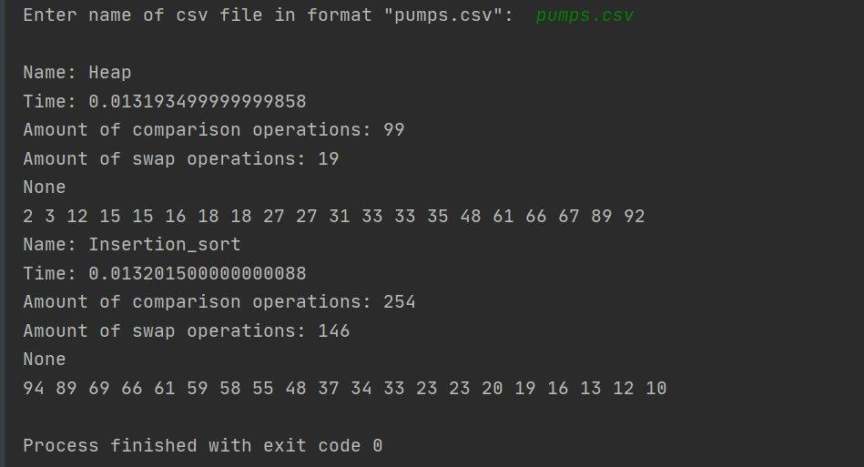

## Sorting water pumps 
**Attributes of class**
* _power in watt_
* _brand_
* _liter per hour_

**Sort methods:**
* Insertion sort 
    * `Descending`
    * `Sorting pumps by power in watts`
    * `Complexity: O(n^2)`
* Heap sort
    * `Ascending`
    * `Sorting pumps by volume of water`
    * `Complexity: O(n*log(n))`

##
### Instruction:

1. First step:`git clone https://github.com/aekrops/algorithms-labs-iot.git`
1. Second step: `cd algorithms-labs-iot` and `cd lab1`
1. Third step: **_enter to command line_** `python main.py`
1. Fifth step: **_enter name of csv file_**

